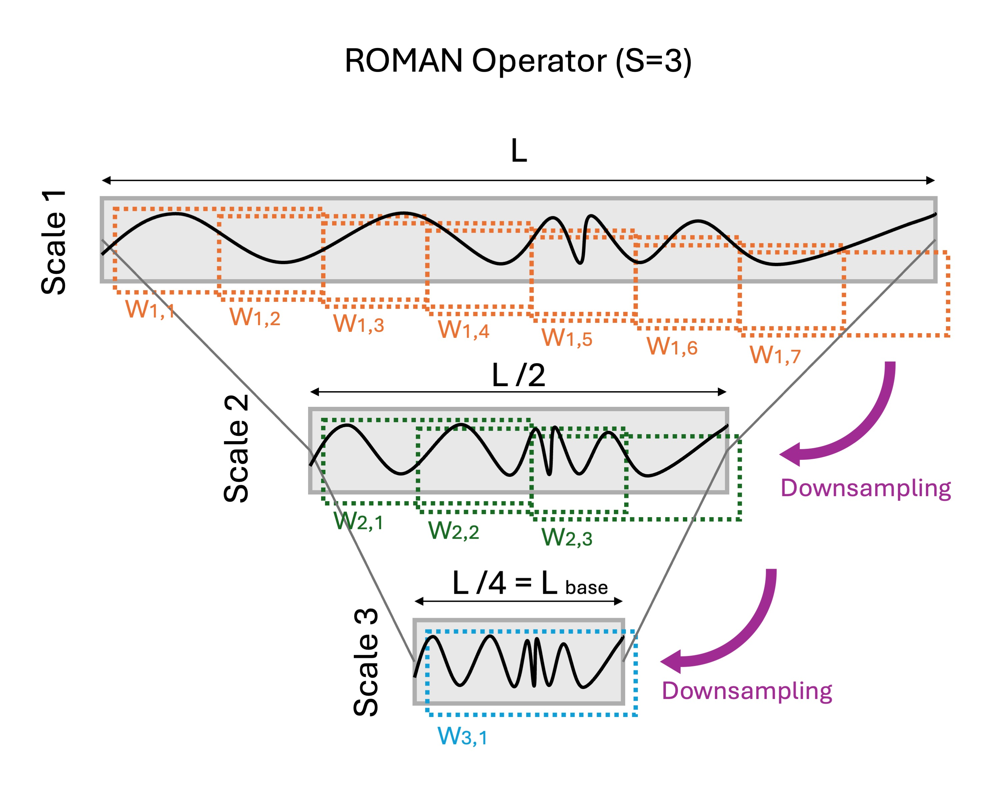

# ROMAN

Official library for the ROMAN operator.

**Paper:** `ROMAN: A Multiscale Routing Operator for Convolutional Time Series Models`  
**Author(s):** `Gonzalo Uribarri`  
**Paper link:** `[Add link here after acceptance]`

ROMAN (ROuting Multiscale representAtioN) is a deterministic front-end operator for time series. It maps temporal scale and coarse temporal position into an explicit channel structure while reducing sequence length. Concretely, it builds an anti-aliased multiscale pyramid, extracts fixed-length windows from each scale, and stacks them as pseudochannels so standard convolutional backbones can operate on a more explicitly multiscale and coarse-position-aware representation.

## Why ROMAN?

ROMAN is not a classifier and it is not intended as an architecture replacement. It is a representation operator that can be inserted before standard convolutional backbones such as MiniRocket, MultiRocket, CNNClassifier, or FCNClassifier. ROMAN modifies the inductive bias of the downstream model by rerouting temporal structure before that model sees the input.

The ROMAN operator is designed to reduce temporal invariance, make temporal pooling implicitly coarse-position-aware, expose multiscale interactions through channel mixing, and improve efficiency by shortening the processed time axis.

## What does ROMAN do?

- creates anti-aliased downsampled views of the same series
- extracts fixed-length overlapping windows at each scale
- stacks those windows as pseudochannels with explicit scale and coarse temporal location meaning
- preserves a familiar `(n_instances, n_channels, n_timepoints)` tensor shape
- shortens the processed temporal axis from `L` to `L_base`

The only relevant parameter for the operator is `S`. Intuitively, `S` controls how strong the routing is. `S=1` is exactly the original input, while larger values of `S` add coarser scales, shorten the processed time axis, and create more pseudochannels. In practice, increasing `S` makes the representation more explicitly multiscale and coarse-position-aware, but also increases the channel dimension.



## Installation

For regular use, install directly from GitHub:

```bash
pip install "git+https://github.com/gon-uri/ROMAN.git"
```

For local development:

```bash
git clone https://github.com/gon-uri/ROMAN.git
cd ROMAN
pip install -e .
```

If you also want the notebook dependencies during local development:

```bash
pip install -e ".[examples]"
```

If you want to use the plotting utilities in `RomanOperator.plot_relevance` during local development, install:

```bash
pip install -e ".[plot]"
```

## Quickstart

```python
import numpy as np
from roman import RomanOperator

X = np.random.randn(32, 3, 512).astype(np.float32)

roman = RomanOperator(
    S=3,
    alpha=0.5,
)

Z = roman.fit_transform(X)

print("Input shape:", X.shape)
print("ROMAN shape:", Z.shape)
print("Pseudochannels:", roman.n_pseudochannels_)
print("Scale lengths:", roman.lengths_)
print("Windows per scale:", roman.windows_)
```

For a typical workflow, fit ROMAN on the training set, transform both train and test sets, and then pass the transformed tensors to your downstream classifier. The `S=1` case is exactly the identity baseline, so varying `S` gives a controlled family of complementary representations.

## Example Notebook

The notebook in [`notebooks/handmovementdirection_minirocket_demo.ipynb`](notebooks/handmovementdirection_minirocket_demo.ipynb) shows a full MiniRocket example on the UEA `HandMovementDirection` dataset:

- baseline MiniRocket on the original input
- MiniRocket on ROMAN-transformed input
- original channel count versus ROMAN pseudochannel count
- a small side-by-side performance summary

The example uses `S=3`, which is the strongest MiniRocket ROMAN setting for this dataset in the appendix tables from the paper artifacts available in the reproduction codebase.

The notebook also sets a few conservative Numba environment defaults before importing MiniRocket, which helps on constrained notebook or shared-server setups. If the dataset is not already cached locally, `sktime` will download it on first use.

## Repository Structure

```text
ROMAN/
├── README.md
├── LICENSE
├── pyproject.toml
├── notebooks/
│   └── handmovementdirection_minirocket_demo.ipynb
└── src/
    └── roman/
        ├── __init__.py
        └── operator.py
```

## Main API

### `RomanOperator`

`RomanOperator` is a scikit-learn style transformer with `fit`, `transform`, and `fit_transform`.

Supported input shapes:

- `(n_instances, n_timepoints)` for univariate data
- `(n_instances, n_variables, n_timepoints)` for multivariate data

Supported scale-selection modes:

- exact scale count with `S` (default)
- pseudochannel budget with `max_pseudochannels`
- expected coverage target for ROCKET-like models with `N` (number of kernels) and `H` (target average kernels per channel)

Key hyperparameters:

- `S` controls the pyramid depth and therefore the common base length `L_base`
- `alpha` controls how densely each scale is tiled by overlapping windows
- `min_timesteps_per_channel` (optional) Put an upper limit on S based on a minimum base length `L_base`

Useful fitted attributes:

- `S_`: selected number of scales
- `L_base_`: common window length after scale selection
- `lengths_`: per-scale sequence lengths
- `windows_`: per-scale window counts
- `n_pseudochannels_`: total number of output pseudochannels

### `choose_S_roman`

`choose_S_roman` exposes the same scale-selection logic used internally by `RomanOperator`. It can be useful when you want to inspect the selected configuration before transforming a dataset.

## Companion Reproduction Repository

This repository is the library-first version of ROMAN. For the full experimental pipeline, see the companion reproduction repository:

- `https://github.com/unknownscientist/ROMAN`

That companion repository should host:

- benchmark entrypoints
- synthetic experiments
- result aggregation scripts
- figure-generation notebooks
- appendix-table generation

Keeping those pieces separate helps this repository stay lightweight and focused on end users.

## Citation

If you use ROMAN in your work, please cite the paper. The venue and final paper URL can be updated once publication details are fixed.

```bibtex
@misc{uribarri2026roman,
  title        = {ROMAN: A Multiscale Routing Operator for Convolutional Time Series Models},
  author       = {Uribarri, Gonzalo},
  year         = {2026},
  note         = {[Venue to update]},
  howpublished = {[Paper link to add]}
}
```

## License

This project is released under the MIT License.
