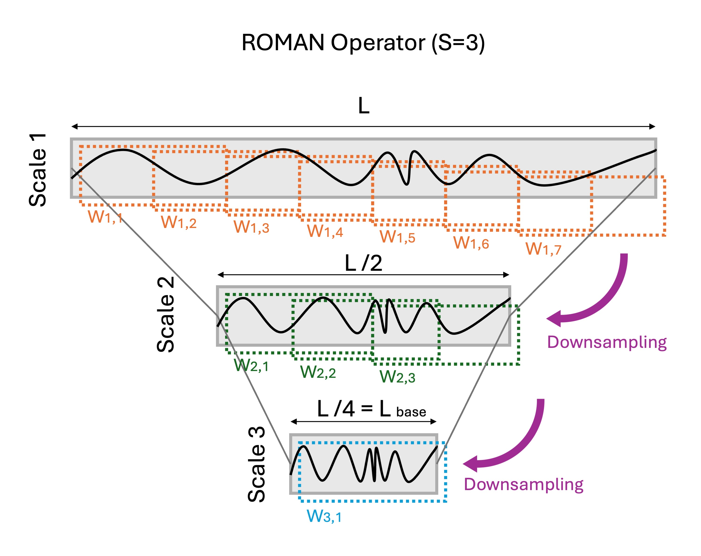

<p align="center">
  
</p>

# ROMAN

Official library for the ROMAN operator.

**Paper:** `ROMAN: A Multiscale Routing Operator for Convolutional Time Series Models`  
**Author(s):** `Gonzalo Uribarri`  
**Paper link:** [https://arxiv.org/abs/2604.02577](https://arxiv.org/abs/2604.02577)

ROMAN (ROuting Multiscale representAtioN) is a deterministic front-end operator for time series. It maps temporal scale and coarse temporal position into an explicit channel structure while reducing sequence length. Concretely, it builds an anti-aliased multiscale pyramid, extracts fixed-length windows from each scale, and stacks them as pseudochannels so standard convolutional backbones can operate on a more explicitly multiscale and coarse-position-aware representation.

## Why ROMAN?

ROMAN is not a classifier and it is not intended as an architecture replacement. It is a representation operator that can be inserted before standard convolutional backbones such as MiniRocket, MultiRocket, CNNClassifier, or FCNClassifier. ROMAN modifies the inductive bias of the downstream model by rerouting temporal structure before that model sees the input.

The ROMAN operator is designed to reduce temporal invariance, make temporal pooling implicitly coarse-position-aware, expose multiscale interactions through channel mixing, and improve efficiency by shortening the processed time axis.

## What does ROMAN do?

- creates anti-aliased downsampled views of the same series
- extracts fixed-length overlapping windows at each scale
- stacks those windows as pseudochannels with explicit scale and coarse temporal location meaning
- preserves a familiar `(n_instances, n_channels, n_timepoints)` tensor shape
- shortens the processed temporal axis from `L` to `L_base`

The central parameter of the operator is `S`. Intuitively, `S` controls how strong the routing is. `S=1` leaves the input untouched, while larger values of `S` add coarser scales, shorten the processed time axis, and create more pseudochannels. In practice, increasing `S` makes the representation more explicitly multiscale and coarse-position-aware, but also increases the channel dimension.



## Installation

For regular use, install directly from GitHub:

```bash
pip install "git+https://github.com/gon-uri/ROMAN.git"
```

For local development:

```bash
git clone https://github.com/gon-uri/ROMAN.git
cd ROMAN
pip install -e .
```

If you also want the notebook dependencies during local development:

```bash
pip install -e ".[examples]"
```

If you want to use the plotting utilities in `RomanOperator.plot_relevance` during local development, install:

```bash
pip install -e ".[plot]"
```

## Quickstart

```python
import numpy as np
from roman import RomanOperator

X = np.random.randn(32, 3, 512).astype(np.float32)

roman = RomanOperator(
    S=3,
    alpha=0.5,
)

Z = roman.fit_transform(X)

print("Input shape:", X.shape)
print("ROMAN shape:", Z.shape)
print("Pseudochannels:", roman.n_pseudochannels_)
print("Scale lengths:", roman.lengths_)
print("Windows per scale:", roman.windows_)
```

For a typical workflow, fit ROMAN on the training set, transform both train and test sets, and then pass the transformed tensors to your downstream classifier. The `S=1` case returns the input unchanged (up to the optional channel normalization; set `normalization=False` for the exact identity), so varying `S` gives a controlled family of complementary representations.

Note that the package installs as `roman-ts` but is imported as `roman`.

## Choosing S and alpha

Practical guidance, following the paper's experiments:

- **`alpha` is a cost knob, not a quantity to tune.** In the paper's benchmarks, no value in `{0, 0.25, 0.75}` differed significantly from the default `alpha=0.5`, and `alpha=0.25` matched it with roughly a quarter fewer pseudochannels. Use the default, or `alpha=0.25` when the channel count matters.
- **Keep the finest windows at the scale of the discriminative structure.** `min_timesteps_per_channel` (the paper's `L_min`) caps the pyramid depth at `S* ~ 1 + floor(log2(L / L_min))`. Choose `L_min` so that windows still contain the local patterns the task depends on — windows shorter than the relevant unit (for example, a phoneme in audio) lose the gain.
- **Select `S` on validation data when you can.** The best `S` is task- and backbone-dependent. In the paper, selecting `S` per dataset by 4-fold cross-validation on the training set turned a fixed `S=4` (a loss on average across the UCR archive) into a small significant gain, mostly by avoiding harmful settings; the procedure is conservative and often keeps `S=1`.
- **Different `S` values give complementary representations.** When no validation data can be spared, a simple ensemble mixing models trained at different `S` values captures part of the same headroom.
- **Efficiency comes with the operator.** Larger `S` shortens the processed time axis, which reduces inference time for ROCKET-style backbones regardless of the accuracy outcome.

## Example Notebook

The notebook in [`notebooks/uea_example.ipynb`](notebooks/uea_example.ipynb) shows a full MiniRocket example on the UEA `EthanolConcentration` dataset:

- baseline MiniRocket on the original input
- MiniRocket on ROMAN-transformed input with `S=4`
- original channel count versus ROMAN pseudochannel count
- a small side-by-side performance summary

The example uses `S=4`, which is the strongest MiniRocket ROMAN setting for this dataset in the appendix tables from the paper artifacts available in the reproduction codebase. The notebook also leaves a few other promising UEA datasets as commented suggestions for users who want to explore additional cases.

The notebook also sets a few conservative Numba environment defaults before importing MiniRocket, which helps on constrained notebook or shared-server setups. If the dataset is not already cached locally, `sktime` will download it on first use.

## Repository Structure

```text
ROMAN/
├── README.md
├── LICENSE
├── pyproject.toml
├── images/
├── notebooks/
│   └── uea_example.ipynb
├── src/
│   └── roman/
│       ├── __init__.py
│       └── operator.py
├── tests/
│   └── test_operator.py
└── .github/
    └── workflows/
        └── ci.yml
```

## Main API

### `RomanOperator`

`RomanOperator` is a scikit-learn style transformer with `fit`, `transform`, and `fit_transform`.

Supported input shapes:

- `(n_instances, n_timepoints)` for univariate data
- `(n_instances, n_variables, n_timepoints)` for multivariate data

Supported scale-selection modes (provide exactly one):

- exact scale count with `S` (the usual choice)
- pseudochannel budget with `max_pseudochannels`
- expected coverage target for ROCKET-like models with `N` (the number of channel-subset draws the downstream transform performs) and `H` (the required expected number of draws covering each pseudochannel)

Key hyperparameters:

- `S` controls the pyramid depth and therefore the common base length `L_base`
- `alpha` (default `0.5`) controls how densely each scale is tiled by overlapping windows
- `min_timesteps_per_channel` (default `32`) is the paper's `L_min`: it puts a lower limit on `L_base` and therefore an upper limit on `S`
- `normalization` (default `True`) z-normalizes each channel with statistics estimated on the training data

Useful fitted attributes:

- `S_`: selected number of scales
- `L_base_`: common window length after scale selection
- `lengths_`: per-scale sequence lengths
- `windows_`: per-scale window counts
- `n_pseudochannels_`: total number of output pseudochannels

### `choose_S_roman`

`choose_S_roman` exposes the same scale-selection logic used internally by `RomanOperator`. It can be useful when you want to inspect the selected configuration before transforming a dataset.

## Companion Reproduction Repository

This repository is the library-first version of ROMAN. The full experimental pipeline behind the paper (benchmark entrypoints, synthetic experiments, result aggregation, figure and appendix-table generation) lives in a companion reproduction repository, whose link will be added here upon publication.

Keeping those pieces separate helps this repository stay lightweight and focused on end users.

## Citation

If you use ROMAN in your work, please cite the paper. The venue and final paper URL can be updated once publication details are fixed.

```bibtex
@misc{uribarri2026roman,
  title        = {ROMAN: A Multiscale Routing Operator for Convolutional Time Series Models},
  author       = {Uribarri, Gonzalo},
  year         = {2026},
  eprint       = {2604.02577},
  archivePrefix = {arXiv},
  howpublished = {arXiv:2604.02577}
}
```

## License

This project is released under the MIT License.

<p align="center">
  
</p>
